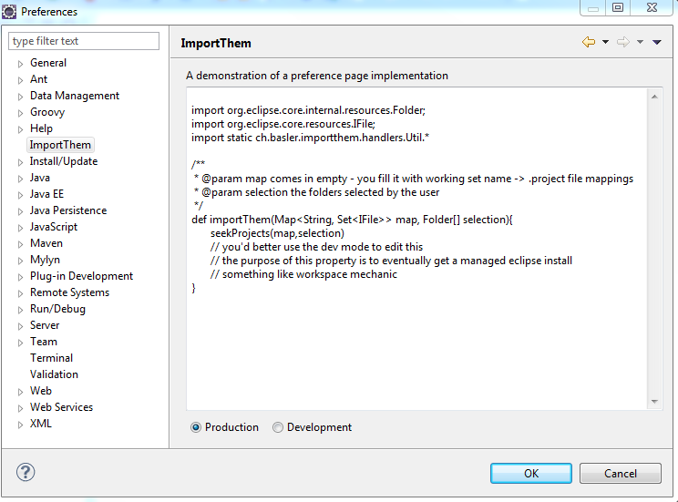
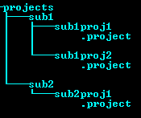
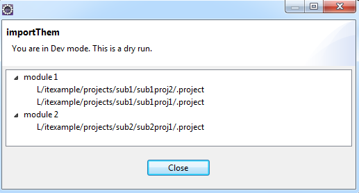

Import Them
==========

A given directory structure grouping some eclipse projects to their working sets and Importing them by hand is a
cumbersome job. Especially when this is a regular job. To automate this work you can use the Import Them 
standard feature or write your own in groovy.

### install 

via [update site](http://baloise.github.io/importthem/updatesite/) 

Extra Groovy compilers/Groovy Compiler 2.0 Feature 

Groovy-Eclipse/Groovy-Eclipse Feature

Uncategorized/JDT Core patch for Groovy-Eclipse plugin

### Manual

In the preference page of eclipse you can see the currently used groovy script with the standard behaviour.

When switching to Development you have Import Them project in your workspace and can edit the groovy script.

If you have a folder in your workspace (only possible in Package Explorer not in Project Explorer) with
a folder and project structure like:

With the standard behaviour we will get two working sets sub1 and sub 2 where sub1 contains projects sub1proj1 and sub1proj2.
Working set sub2 would contain sub2proj2. 
When in Development mode right clicking the projects folder and selecting Import them will execute a dry-run.

Expect you modified the standard behaviour like:

The dry-run will then show the following result.

The parameters of the script are map and selection.
The key of the map is the name of the working, when using seekProjects it is the name of the parent parent folder
of the .project file.
Selection are the selected folders in the package explorer.
The selection could be traversed in the groovy script itself, seekProjects is just a default behaviour.
In the example script the resulting map is edited by replacing sub1 with module1 and so on.

